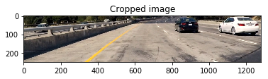

# Vehicle Detection
---

This repo contains an image processing pipeline capable of lanes and vehicles identification. The lane identification was build using image processing techniques for edges identication and filtering. The vehicle identification works using a deep learning algorithm.

# Objectives

* Build a convolutional neural network for vehicles identification
* Train the CNN using an available dataset
* Implement an algorithm for searching and identifying the location of vehicles on video frames.
* Filter possible false-positives that may appear.
* Estimate and draw a bounding box for detected vehicles.
* Combine the vehicles identification algorithm with the lanes finder algorithm from the fourth project.

# 1. Convolutional deep neural network
The CNN model uses three convolutional NN, each with a max pooling layer, which helps reducing the number of parameters, and false-negative incidents. The convolutional layers are followed by three fully conected layers, in which dropout was applied, except for the output layer. The model can be found in **model.py**. The data used for training the model was provided from the Udacity SDCND, which is a recopilation of the  GTI vehicle image database, and the KITTI vision benchmark suite. The model accuracy reached up to 99%. The model also presented a very good performance at identifying vehicles from the frontal camera images provided for this project, with **very few false negatives**.

**Note**: a SVM was also trained for the same task as the DNN. Even though the SVM model presented a very high accuracy on synthetic benchmarks, **it showed a very poor performance on the actual video footage of the project**.

# 2. Vectorized sliding-window implementation
First, the image is cropped at the top and bottom, where cars will not appear. 

Then, a *vectorized* sliding window search through the cropped image. An small window in defined in the **slide_window** function using the parameter **xy_window=(w,h)**. For this project a 64x64 window presented a good performance. 
This implementation is tagged as vectorized, because instead of just sliding through each window, all the windows are introduced as a batch into the DNN. In this project, Keras is executed in a GPU, wich reduces the computational time.
After the sliding window algorithm is executed, the output are multiple windows, in which there is high probability to find a vehicle. An example is shown below.

Notice that there is some false positives on the left side. A heatmap is generated using the overlapping matched windows. Each overlapping add one point to the intersection area. Then, in order to filter the outlier windows, a minimum threshold is applied. All locations below the threshold are erased. The heatmap is generated by the function **add_heat()**. Then, adjacent boxes are grouped together using the function **draw_labeled_bboxes**, with the information from the heatmap. All the functions mentioned in the this section can be found in **image_match.py**

# 3. Video Pipeline
All the steps mentioned before are put together in the video processing pipeline. First, the image is cropped and sectioned in multiple small searchable windows. Then, the image search is run through all those windows. After that, the vehicle locations are identified using the heatmap. False-negative are filtered using a minumum threshold to the heatmap.

Also, the lane identification algorithm from the fourth project of the SDCNN from Udacity is added. An small fragment of the video can be seen below. 

[Link to the complete video](./project_video_output.mp4)

The video pipeline is implemented inside **car_detection_pipeline.py**

**Processing time**: The actual pipeline (lanes and vehicles identification) runs at approximately 2.5 fps using a GTX1060 with Keras, and a Core i5-2500K. Since the project video was recorded at 25fps, the performance of the pipeline is still not suitable for real-time implementation.

# 4. Conclusions and future work
In this project, an image processing pipeline for vehicle and lanes identification was made. The lane identification was coded using traditional image processing techniques, while the car identication had at its core a DNN with three CNN. As can be seen in the final video, the results of the pipeline are promising. However, the speed of the pipeline is still insuficient for real-time implementation. For the lane identification, it may be possible to optimize part of the algorithm using parallel programming (CUDA e.g.). For the vehicle identification, state of the art algorithms like [SSD](https://arxiv.org/abs/1512.02325) and [YOLO](https://pjreddie.com/darknet/yolo/) shows very promising results and performance (up to 150 fps in a GTX TITAN using YOLO).

The SVM approach, although it presented good results on the synthetic benchmarks, it was not able to generalize well enough on the project video, because it tended to produce too many false negative. The DNN model presented a much more robust performance. Also, since Keras is optimized for GPUs, the speed was significantlly higher.
